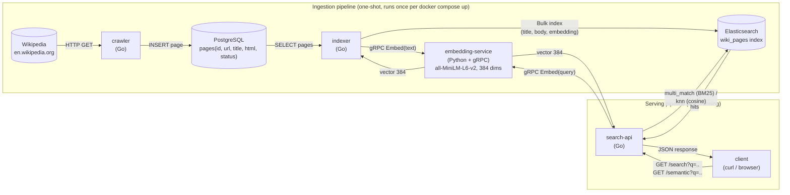

# Wikipedia Search Engine

A small Wikipedia search engine built as a set of independent microservices, each one added as a
homework assignment (see `0_.md` .. `5_.md` in this directory for the original specs):

1. **Crawl** Wikipedia pages into PostgreSQL.
2. **Index** them into Elasticsearch with BM25 full-text search (title/body).
3. **Embed** each page into a 384-dim vector via a dedicated ML microservice.
4. **Serve** both keyword search (`GET /search`) and meaning-based semantic search
   (`GET /semantic`, kNN over embeddings) through one HTTP API.

Every service is independently buildable, testable and lintable, and the whole stack runs with a
single `docker compose up`.

## Architecture



A draw.io/diagrams.net version of the same diagram (easier to edit) is at
[`docs/architecture.drawio`](docs/architecture.drawio) — open it at
[app.diagrams.net](https://app.diagrams.net) (File → Open) or with the draw.io desktop app.

### Components

| Service | Language | Role | Port (host) |
|---|---|---|---|
| [`crawler`](crawler/) | Go | Breadth-first crawls Wikipedia from a seed URL, saves raw pages to Postgres | — (one-shot) |
| [`indexer`](indexer/) | Go | Cleans HTML into title/body, calls `embedding-service` for a vector per page, bulk-indexes into Elasticsearch | — (one-shot) |
| [`embedding-service`](embedding-service/) | Python | Turns text into a 384-dim embedding via `sentence-transformers`, served over gRPC | `50051` |
| [`search-api`](search-api/) | Go | HTTP API: `GET /search` (BM25) and `GET /semantic` (kNN) | `8080` |
| `postgres` | — | Stores crawled pages | `5432` |
| `elasticsearch` | — | Stores indexed documents + embeddings, runs BM25 and kNN queries | `9200` |
| [`e2e`](e2e/) | Python (pytest) | Drives the real docker-compose stack and asserts on the whole pipeline | — (test suite) |
| [`proto`](proto/) | Protobuf | Shared `embedding.proto` contract between `indexer`/`search-api` (Go clients) and `embedding-service` (Python server) | — |
| [`postgres/init`](postgres/) | SQL | Schema migration applied on first Postgres start | — |

`crawler` and `indexer` are one-shot containers: `docker compose` runs them to completion once
(`restart: "no"`), in this order — crawler, then indexer (which waits on
`embedding-service` and `elasticsearch` being healthy) — after which `search-api` starts and
stays up.

## Technologies

* **Go 1.25** for `crawler`, `indexer`, `search-api` — `github.com/Masterminds/squirrel` (SQL
  builder, no raw SQL strings), `jackc/pgx/v5` (Postgres driver), `go.uber.org/zap` (structured
  logging behind a `Logger` interface), `google.golang.org/grpc` + `google.golang.org/protobuf`
  (embedding-service client), `golangci-lint` (see `GOLANG_SERVICE_PROMPT.md` for the house style
  every Go service follows).
* **Python 3.11** for `embedding-service` — `grpcio`, `sentence-transformers` (`all-MiniLM-L6-v2`,
  384-dim embeddings) on CPU-only PyTorch, weights baked into the Docker image at build time.
* **PostgreSQL 16** — durable store for raw crawled pages.
* **Elasticsearch 8.15** — BM25 full-text search (`multi_match` over `title^3`/`body^1`) and
  vector search (`dense_vector`, cosine similarity, `knn` query).
* **Docker Compose** — orchestrates the whole stack; each service has its own `Dockerfile`.
* **pytest** (`e2e/`) — end-to-end tests against the real stack (no mocks): Postgres rows,
  Elasticsearch mapping/documents, both HTTP search endpoints.

## Quick start: run everything and curl it yourself

From the repository root:

```sh
cp .env.example .env   # optional: override ports/seed URL/model name/etc.
docker compose up --build
```

The first run builds every image — `embedding-service` bakes in the ML model weights, which can
take a few minutes; later runs reuse Docker's layer cache and are much faster.

Watch the one-shot jobs finish:

```sh
docker compose logs -f crawler indexer
```

`indexer` exits once it has bulk-indexed every crawled page. At that point `search-api` is up on
`http://localhost:8080` (adjust the port if you changed `SEARCH_API_PORT`). Now you can:

```sh
# Keyword search (BM25, title weighted 3x over body)
curl "http://localhost:8080/search?q=Elasticsearch"
curl "http://localhost:8080/search?q=Lucene&from=0&size=10"

# Semantic search (kNN over embeddings) -- finds pages by meaning, not exact words
curl "http://localhost:8080/semantic?q=how%20search%20engines%20work"
curl "http://localhost:8080/semantic?q=how%20search%20engines%20work&k=5"
```

Both endpoints return the same shape:

```json
{"hits": [{"title": "Elasticsearch", "url": "https://en.wikipedia.org/wiki/Elasticsearch", "score": 13.42}]}
```

Inspect the intermediate state directly:

```sh
# Rows the crawler saved
docker compose exec postgres psql -U wiki -d wiki -c 'SELECT id, title, status, url FROM pages;'

# Documents the indexer wrote (including the embedding vector)
curl "http://localhost:9200/wiki_pages/_search?size=1&pretty"

# Index mapping (confirms the dense_vector field: dims=384, similarity=cosine)
curl "http://localhost:9200/wiki_pages/_mapping?pretty"
```

Tear everything down (drops the Postgres/Elasticsearch volumes, so the next `up` starts from a
clean crawl):

```sh
docker compose down -v
```

> **Note on crawl breadth**: with the default seed (the "Elasticsearch" article), the crawler
> currently only saves 2 pages. This isn't a `CRAWLER_MAX_PAGES`/`CRAWLER_MAX_DEPTH` limit — most
> in-body Wikipedia links are now absolute URLs, and the crawler's link extraction only follows
> same-page-relative `href="/wiki/..."` links, so only the one relative link every article has
> (to `/wiki/Main_Page`) gets followed. See [`crawler/README.md`](crawler/README.md) for details
> if you want to extend it.

## Running the tests

Each Go service is self-contained and lints/tests independently:

```sh
cd crawler && make test && make lint    # or indexer/, search-api/
```

`make lint` installs a pinned `golangci-lint` into `<service>/bin` on first run (no `PATH` changes
needed).

`embedding-service` (Python) has its own `make test`/`make lint`, backed by a local `.venv`:

```sh
cd embedding-service && make test && make lint
```

The end-to-end suite in [`e2e/`](e2e/) drives the real `docker compose` stack (build, crawl,
index, embed, search — no mocks) and is the most complete correctness check:

```sh
cd e2e
python3 -m venv .venv && source .venv/bin/activate
pip install -r requirements.txt
pytest
```

See [`e2e/README.md`](e2e/README.md) for what each test checks and the environment variables that
control it (e.g. `E2E_SKIP_COMPOSE` to test against a stack you already started by hand).

## Observability

For connecting a GUI client (e.g. DBeaver) to Postgres, browsing Elasticsearch's indices and
documents (REST API examples, plus an optional one-off browser UI), and tailing every service's
logs live, see [`OBSERVABILITY.md`](OBSERVABILITY.md).

## Configuration

All services are configured through environment variables; every variable with a sensible default
is listed with that default in [`.env.example`](.env.example) — copy it to `.env` and
`docker compose` picks it up automatically. Each service's own README documents its variables in
more detail.

## Repository layout

```text
.
├── crawler/            Go: Wikipedia -> Postgres
├── indexer/             Go: Postgres -> Elasticsearch (+ calls embedding-service)
├── embedding-service/   Python: text -> 384-dim vector, over gRPC
├── search-api/          Go: GET /search, GET /semantic
├── proto/               shared embedding.proto (Go + Python codegen source)
├── postgres/            init SQL applied on first Postgres start
├── e2e/                 pytest end-to-end tests against the real stack
├── docs/                architecture.drawio
├── docker-compose.yml   wires all of the above together
├── .env.example         every configurable env var, with its default
└── GOLANG_SERVICE_PROMPT.md   the house style every Go service follows
```

Each directory above has its own `README.md` explaining its internal structure, its extension
points, and any project-specific conventions — read that first before changing a service.
